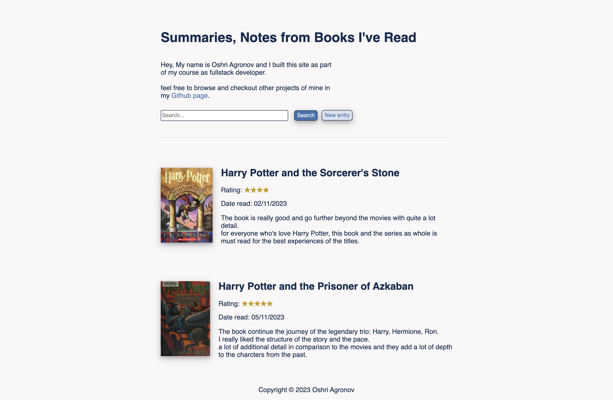

# Book Notes


<br>
The project is a site where you share an short paragraph about a book you read already, that short paragraph called "Notes"!

## Table of contents
* [General info](#general-info)
* [Technologies](#technologies)
* [Features](#features)
* [Screenshots](#screenshots)
* [Setup](#setup)
* [Acknowledgements](#acknowledgements)

## General info
The project is a site where you write short opinions about the books and they are called “Notes” (250 chars).
In the site you have the title and short paragraph "about the site" and "me", below you have a search bar and button
to create a new note.


## Technologies
- Software language: JS, HTML, CSS.
- Frameworks: Node.js .
- NPM modules dependencies: express, pg, bodyParser, axios.
- Database: Postgres (SQL).

## Features
- The site will fetch the book cover and title by the isbn the user is write(through openLibrary api).
- The user can search through the notes by entering the title name or part of it.
- All the data is saved locally using Postgres as database, so refresh the page won't erase the data.

## Screenshots



## Setup
To run "Book Notes" you need couple of softwares:
- node.js .
- npm modules I included(easy to install).
- PostgresSQL.
> You can install all the above pretty easily with a quick search on youtube for a guide.

### How to start?
1. First download the folder with the files from the repo.
2. Open terminal in the project folder and install all the modules by the entering the commend:

```bash
npm i
```

3. Run the project with node(or nodemon):

```bash
node app.js
```
4. Open the browser and enter in the url bar:
```
localhost:3000
```
5. And you are done! enjoy you personal post site.

## Acknowledgements
I would like to thank openLibrary for give free access to their api, it's massively help me with the project. <br>
I would like to thank to Dr. Angela Yu for creating the great course "The Complete 2023 Web Development Bootcamp".
> Link to the course [here](https://www.udemy.com/course/the-complete-web-development-bootcamp/?kw=The+Complete+2023+Web+Development+Bootcamp&src=sac)
